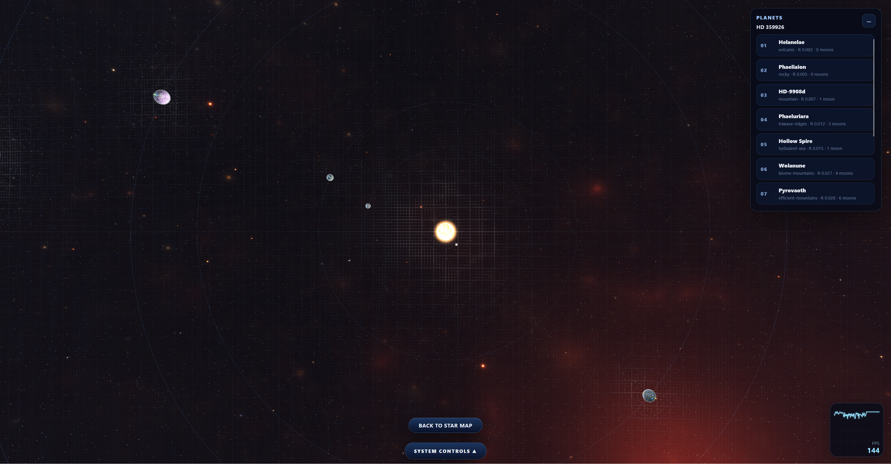
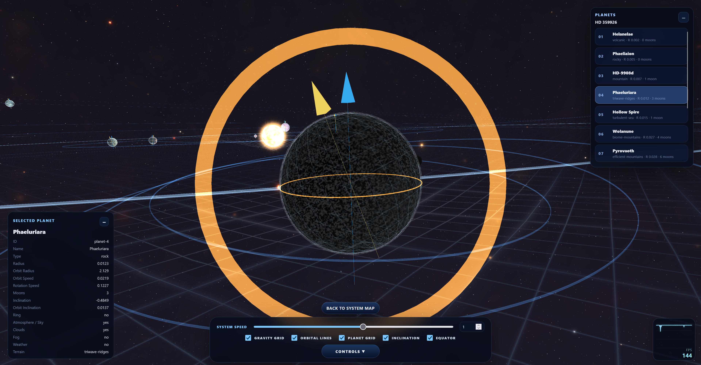

# Space-Flyer

An intentionally inaccurate browser space-sim and visual exploration sandbox built with **Vite**, **Three.js** and plain ES modules.

> Space-Flyer is not a scientific simulator. It is a stylized, configurable space playground focused on atmosphere, shader-driven worlds, procedural systems and fast iteration.

---

## Features

- **Star Map** with generated systems, stellar-object signals, sectors, bookmarks, route lines and a star log.
- **System View** with stars, planets, moons, rings, orbit paths and a gravity-grid visualization.
- **Orbit View** with focused planet/moon inspection, cloud shells, rings, aurora ribbons and moon shadows.
- **Terrain View** with flight controls, raymarched terrain, atmosphere, fog, clouds, aurora, weather, local rings, sky objects and terrain bookmarks.
- **Stellar Object View** for black holes, neutron stars, pulsars, quasars, nebulae and space-rock-style anomalies.
- **Save / Load Config** with hybrid persistence:
  - fixed galaxy map / signal list,
  - full snapshots for visited, bookmarked, edited or current systems,
  - seed-based regeneration for unknown systems,
  - saved star log, bookmarks, terrain bookmarks, options and controls.
- **Adaptive Terrain Performance** with terrain-only render scaling and optional pixelation based on a target FPS.
- **Config / Dev UI** for planets, terrain shaders, atmosphere, fog, clouds, aurora, rings, moons, space shaders, display settings and controls.

---

## Screenshots


Star Map


System Map


Orbit View


Terrain View

---

## Tech stack

- Vite
- Three.js
- JavaScript ES modules
- GLSL shader materials
- JSON-first config / save format

---

## Development

```bash
npm ci
npm run dev
```

Build:

```bash
npm run build
```

Preview a production build:

```bash
npm run preview
```

If Vite or Esbuild binaries lose execute permissions after unpacking a ZIP on Linux:

```bash
chmod +x node_modules/.bin/vite node_modules/vite/bin/vite.js node_modules/@esbuild/linux-x64/bin/esbuild || true
npm run build
```

---

## Dev Mode

Press `F2` to open or close Dev Mode.

Dev Mode exposes the configuration panels for editing systems, stars, planets, moons, terrain shaders, atmosphere, fog, clouds, aurora, rings, space settings and stellar objects. Changes made through these panels are treated as config edits and are included in Save / Load Config exports and browser saves.

`F2` is the default Dev Toggle key and can be changed in the Options menu. `Esc` remains reserved for opening and closing Options.

---

## First Launch / Shader Warm-up

Space-Flyer compiles and warms up many shader and view combinations during startup. Depending on hardware and browser, the initial warm-up can take several minutes, commonly around **3–5 minutes** on slower systems.

After warm-up is complete, switching between Star Map, System View, Orbit View, Terrain View, Stellar Object View and bookmarked locations should have (if at all little to) no additional waiting time.

---

## Controls

Default controls:

| Input | Action |
|---|---|
| `Esc` | Open / close Options |
| `F2` | Toggle Dev / Config UI |
| `W / S` | Increase / decrease target speed |
| `A / D` | Strafe left / right |
| `Q / E` | Roll left / right |
| `Space / C` | Move up / down |
| `Shift` | Boost |
| `R` | Reset terrain-flight position |
| `X` | Level roll |
| `Tab` | Mode Back, e.g. return from Stellar Object View to Star Map |
| Mouse drag / wheel | Rotate and zoom map/system/orbit views |
| Left click in Terrain View | Request pointer lock for flight controls |

Controls can be changed in the Options menu. `Esc` is reserved for the menu.

---

## Project structure

Info can be found in doc/overview.md-

---

## Architecture notes

Space-Flyer keeps persistent data and temporary runtime state separate.

```txt
createDemoGalaxy()
→ normalizeGalaxyConfig()
→ createStore(galaxyConfig)
→ AppRenderer
→ StarMapView / SystemView / TerrainView / StellarObjectView
→ UI panels and options
```

Persistent data lives in normalized config/save objects:

- galaxy map,
- systems,
- stars,
- planets,
- moons,
- terrain and visual parameters,
- display/render/options,
- save snapshots and progress.

Runtime-only state stays out of saves:

- FPS counters,
- adaptive runtime render scale,
- pointer lock,
- drag/hover state,
- active transitions,
- warmup state,
- temporary screen-space marker positions.

---

## Save format

The current save system is a hybrid snapshot model.

Unknown signals are stored as stable map records:

```txt
id + kind + seed + position + discovered state + visual map fields
```

Visited, bookmarked, edited or currently active systems are stored as full snapshots.

This keeps the galaxy map stable while still allowing unknown systems to be regenerated from seed data.

Browser saves use:

```txt
localStorage["space-flyer.save.v1"]
```

Manual export/import uses JSON.

---

## Performance notes

Terrain View is the expensive path. It currently uses fullscreen raymarching and repeated terrain-height evaluation per pixel.

The Options menu includes terrain-only performance controls:

- target FPS,
- adaptive terrain render scale,
- optional adaptive pixelation,
- terrain view size,
- terrain max render distance.

Star Map, System View, Orbit View and Stellar Object View remain full-size unless changed by the browser/window itself.

A future terrain rewrite should likely move toward a heightmap/mesh/clipmap hybrid while keeping the current raymarch path as a reference.

---

## Current terrain shaders

Active terrain shader IDs include:

- `none`
- `rocky`
- `frozen-lake`
- `mountain`
- `volcanic`
- `efficient-mountains`
- `biome-mountains`
- `triwave-ridges`
- `soft-dunes`
- `turbulent-sea`

Additional experimental shader files may exist in the source tree but are not necessarily registered as active options.

---

## Status

Space-Flyer is a work-in-progress prototype. The current focus has shifted from adding major visible features to internal cleanup, performance work, generator refinement and shader architecture revision.

Known next-level improvements:

- mesh/heightmap terrain backend,
- better generator rules for zones, radius, mass and moon spacing,
- shader-core / extended-layer consolidation,
- cleanup of inactive shader experiments,
- code splitting for smaller production chunks.

---

## License

This project is released under the MIT License.

You are free to use, modify, fork, and distribute the code, including for commercial purposes, as long as the original license notice is included.
